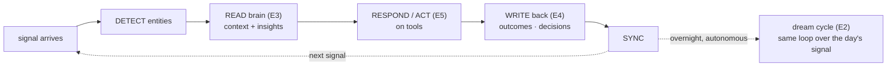

# AL AIOS — Node & Relationship Spec

**Date:** 2026-05-31 (for Jun 2 workshop — Oliver, Jon, Danny, Felipe)
**Purpose:** The blueprint for the architecture diagram. Defines every node, what lives inside it, and every connection as a labelled, directional verb — so the diagram can be built without ambiguity.
**Companion to:** [[2026-06-02-Workshop-Diagrams]]
**Grounded in:** [[GBRAIN-RESEARCH]] · [[AIOS-FIRM-ARCHITECTURE]] · [[GBRAIN-SKILL-PORT-PLAN]] · [[product-architecture]] · GStack / GBrain / OpenBrain source research

---

## 0. The one-sentence thesis

> AL's AIOS is **two cores** — an **OS** (how the firm works: skills) and a **Brain** (what the firm knows: an *intelligent* relational data layer) — sitting between the **tools** where data lives today and the **people** who need to act on it. The Brain is not a database; it is a database **plus a skill system that keeps it current, learns from every action, and enriches itself on a schedule.** That self-building intelligence is the entire point.

GStack proved the OS half (a better operating system for *one* agent beats more agents). GBrain proved the Brain half (markdown + retrieval + a brain-agent loop that compounds). We are rebuilding GBrain's *behaviour* on **relational rails** (Postgres/Supabase via OpenBrain) so it scales to a 20+ person firm and can drive a real dashboard.

---

## 1. Naming decision: nodes, not layers

We call OS and Brain **cores** (or **nodes**), not layers. "Layer" implies a vertical stack where each only talks to the one below. The real shape is two peer cores that exchange context, flanked by tools (right) and people (left). Everything else (Dashboard, AI sessions) is an **interface onto** those two cores.

Reserve "layer" for *inside* the Brain (the data tiers).

---

## 2. The nodes

| # | Node | One-line definition | What lives inside |
|---|------|--------------------|-------------------|
| **N1** | **Tools** | The systems of record — where AL's data is created and lives today. | CMap (fees, timesheets, stages) · Pipedrive (CRM, bid/loss history) · Google Workspace (email, calendar, drive) · Egnyte (drawings, ISO/QA docs) · Xero (invoices, cash) · ArchiCAD (BIM) · *Notion (interim canonical store, Phase 1)* |
| **N2** | **Brain — Knowledge core** | The intelligent relational data layer. Always-current, queryable, self-enriching. = GBrain behaviour on Postgres. | **(a) Schemas** (AL-specific IP) · **(b) Brain skill system** (maintains/learns/enriches/evolves) |
| **N2a** | **Schemas** | The structured store (Supabase/Postgres, OB1 base), custom to AL's workflows. Three schemas. | **Operational** (projects, clients, roles, contacts, progress boards, decisions, audit trail) · **Analytical** (fact tables + KPI rollups: CMap fee actuals, win rates, scope history, time series) · **Vector** (pgvector: past proposals, doc chunks — Egnyte PDFs, ISO policies, ALAQEP; Cognee feeds this in Phase 2) |
| **N2b** | **Brain skill system** | The "what makes it smart" engine. Runs the brain-agent loop inline and the dream cycle on a schedule. | enrich · consolidate · derive-insights · evolve-schema · sync |
| **N3** | **OS — Operational core** | How the firm works, expressed as skills = AL-specific SOPs. = GStack for AL. | **(a) Skills** · **(b) OS skill system** (maintain/learn/improve the skills themselves) |
| **N3a** | **Skill** | One documented workflow (e.g. `/scope-draft`). Queries the Brain for context, acts on tools, writes outcomes back. | **Static context** (SOP text, templates, reference scripts baked in) · **Dynamic context** (queried live from the Brain at run time) · **Connections** (to tools, to act) |
| **N4** | **AI execution** | The runtime. One AI session per operator — the "cognitive gears" that execute skills. | Claude Code / Codex (interchangeable engines; one session = one operator running a workflow) |
| **N5** | **Dashboard** | The interface onto the Brain. Renders structured data *and* lets an operator trigger skills via AI. Optional sugar — the system is fully operable through AI alone. | Metabase-style views · workflow triggers |
| **N6** | **Users** | The people. | Director (Jon · Oliver) · Senior · Team |

---

## 3. The relationships (the edge spec)

Every edge is **directional** and labelled with a **verb**. This is the literal build list for the diagram arrows.

| # | From → To | Label (verb) | What actually happens |
|---|-----------|--------------|----------------------|
| **E1** | **Tools → Brain** | `sync (scheduled, n8n ETL): extract → transform → load → embed` | n8n runs scheduled ETL per source system, normalises into the schemas, then embeds into the vector layer. The vector store is a *derived index, not the source of truth* (GBrain sync contract). |
| **E2** | **Brain ⟲ Brain** (N2b → N2a) | `dream cycle: enrich · consolidate · derive insights · evolve schema` | Nightly + inline. Enriches thin records, rewrites compiled truth, mines patterns/insights from accumulated events, evolves the schema as new IP appears. **This is the intelligence loop.** |
| **E3** | **Skill ⇄ Brain** (read) | `query: up-to-date context + insights` | Brain-first. At run time a skill asks the Brain for current context and derived insights — *not* the raw tools. If the Brain is well-built, this is the only read path. |
| **E4** | **Skill → Brain** (write) | `write-back: outcomes · decisions · provenance` | After acting, the skill writes results back to the Brain (the "WRITE" step of the brain-agent loop). Every action makes the Brain richer. |
| **E5** | **Skill → Tools** | `act: write / create` (+ `live-fetch` fallback only) | Skills touch tools **only to act** — create a file, update a record, log an outcome. Live reads from tools are a fallback for when the Brain can't serve it yet. |
| **E6** | **AI session ⇄ OS** | `invoke + execute` | The operator's AI session loads and runs a skill (loads static context, then runs E3/E4/E5). |
| **E7** | **Brain → Dashboard** | `read: structured views + metrics (Metabase)` | Metabase reads the Supabase schemas directly via SQL — projects, financials, progress, win rates. No custom dashboard code. Possible *because* the schemas are defined. |
| **E8** | **Dashboard → AI session** | `trigger workflows` | The operator fires a skill from the Dashboard. The Dashboard is a trigger surface, not a separate engine. |
| **E9** | **Users ⇄ Dashboard** | `view data · trigger tasks · capture insights` | Director views; team triggers tasks; senior captures/archives insight. |
| **E10** | **Users ⇄ AI session** | `direct operation (no dashboard required)` | Operators can run the whole system through AI alone. Dashboard improves UX; it is not load-bearing. |

### The governing principle (state this on the slide)

> **Reads come from the Brain. Actions go to the Tools.** Skills don't poll the tools for context — the Brain already holds the current truth (kept fresh by E1). Skills reach a tool only to *change* something (E5). This is the sharper version of "each layer only knows the one below it."

### The brain-agent loop (E3 → E4, the heartbeat)

```
signal → DETECT entities → READ brain (E3) → RESPOND/ACT (E5) → WRITE back (E4) → SYNC
```

Runs inline during every workflow. The dream cycle (E2) is the same loop run autonomously overnight over the day's accumulated signal.

---

## 4. What makes it smart (the defence vs "just a database")

Four mechanisms, all borrowed from GBrain, all expressible in relational terms:

1. **Brain-agent loop (E3/E4)** — every workflow reads *and writes* the Brain, so the data layer grows from the firm's own actions, not just imports.
2. **Dream cycle (E2)** — scheduled enrichment, consolidation, and **insight derivation**. The system mines patterns (win/loss, scope creep, fee benchmarks) the moment enough events accumulate. This is what OpenBrain's insights/`thoughts` table + GBrain's nightly job give us together.
3. **Four primitives** under the schemas: **entity registry · event ledger · fact store · relationship graph** — the structure that lets it reason, not just store.
4. **Compiled truth + timeline** per entity: always-current synthesis above, append-only evidence below. The agent reads the synthesis instead of re-deriving it every query.

The compounding promise for AL (concrete): Session 1 = one fee proposal; Session 30 = CMap benchmarks across 30 project types, scope automation accurate; Year 1 = every proposal starts with AL's full institutional history. Oliver's memory stops being the single point of failure.

---

## 5. What we take from each system (the "why these elements" slide)

| Source | Role for AL | What we adopt | What we leave |
|--------|-------------|---------------|---------------|
| **OpenBrain (OB1)** | **The base / target store** | Supabase/Postgres + pgvector · MCP connection pattern · insights/`thoughts` table · derived vector index · auto-generated REST APIs (agents query the data layer, not source systems) | Multi-client shared-memory-bus framing. |
| **GStack** | Pattern source (OS) | Role-specialised skills sequenced by the operator; verification discipline; "better OS for one agent." | Multi-agent framing; the coding-specific browser runtime. |
| **GBrain** | Pattern source only — **tool eliminated for AL** | The *behaviours* we replicate on relational rails: brain-agent loop · dream cycle · compiled-truth+timeline · four primitives · brain-first reads. | The tool itself: markdown-only store, no SQL/multi-user/time-series — breaks at AL's 50-person scale. (Stays as the personal MOLANO-OS brain only.) |
| **Cognee** | **Phase 2 — vector layer** | ECL auto-entity extraction from the Egnyte corpus (ISO/ALAQEP/QA PDFs); self-improving graph (memify); AEC ontology (RIBA stages, consultant types). Feeds / becomes the Supabase **vector** schema. | As a standalone solution — it has no SQL fact tables, can't answer deterministic financial/KPI queries. It's one-third of the stack, not the whole. |
| **n8n** | ETL mechanism | Scheduled, no-code/low-code visual pipelines per source system — maintainable by Oliver / Roman / Dr Logic post-build. | — |
| **Metabase** | Dashboard layer | Reads Supabase directly via SQL; no custom dashboard code. | — |
| **AL custom** | **The IP** | The **three schemas** — operational, analytical, vector — designed around AL's workflows (projects, fee actuals, scope history). | — |

**The resolved stack:** `n8n (scheduled ETL) → Supabase/Postgres [Operational · Analytical · Vector schemas] → Metabase (dashboards) + AI agents (RAG + context).` OB1 is the base; Cognee slots into the vector schema in Phase 2.

---

## 6. Open questions for the workshop

### Resolved (carry as decisions, not debate)

- **Tooling.** OB1/Supabase three-schema platform is the **target**. `n8n → Supabase → Metabase + agents`. **GBrain eliminated** for AL (personal-use only). **Cognee** = Phase 2 vector layer, not standalone. (See §5.)
- **Sequencing risk to name out loud — the "platform trap"** (Danny's own words, May 28): *"You fall into building a platform and then waiting to use it, which gives no return."* Full three-schema Supabase + ~5 n8n integrations = 4–6 weeks of data engineering before `/scope-draft` runs once. So: **Option 1 is the right target, wrong Phase 1 starting point.** Phase 1 should stand up the minimum slice (CMap + Pipedrive → operational + analytical) that lets one skill run end-to-end; Egnyte/Cognee vector layer is Phase 2.

### Open

1. **Schema definition — the actual IP work.** Which entities, fact tables, and relationships in Phase 1? Specifically: how do CMap fee actuals map to Pipedrive scope/loss decisions in the analytical layer? (Danny's open question from May 28.) This is the gating dependency — the analytical fact tables require knowing exactly which queries the agents must answer.

3. **Notion's role.** Is Notion the *interim* canonical store while we validate the schema, with Supabase as the Phase 2 target — or do we go straight to Supabase? ([[2026-06-02-Workshop-Diagrams]] assumed interim Notion.)

4. **Vector layer scope.** Is the vector index derived purely from the relational store (OB1 default), or does it also ingest unstructured Egnyte/ISO docs directly? This decides whether Egnyte is a Phase 1 connection.

5. **One AI engine or two on the diagram?** Claude Code and Codex are interchangeable execution engines. Show both (to make "one session per operator" legible) or collapse to a single "AI session" node for clarity? (Recommendation: collapse to one labelled "Operator AI session (Claude Code / Codex)".)

6. **Dashboard build vs buy.** Metabase on top of Supabase schemas (fast, generic) vs a custom UI (slower, branded)? Affects how the Dashboard node is drawn.

7. **IP / ownership boundary.** Who owns the skills, the Brain schema, and the integrations? Per [[product-architecture]], this should be settled *before* the workshop produces a detailed backlog — a backlog creates implicit commitments.

---

## 7. Recommended visual structure for the build

Left → right, two cores in the centre:

```
[Users] ─ [Dashboard] ─ [AI session] ═══ [ OS: Skills ] ⇄ [ BRAIN: Schemas + Skill system ] ─ [Tools]
                                              │ act ↓                    ↑ sync (scheduled)
                                              └──────────→ [Tools] ←─────┘
```

- Two big boxes centre-stage: **OS** and **BRAIN**, same visual weight (they're peers).
- **Tools** as a right-hand rail; **Users → Dashboard → AI** as the left-hand approach.
- Draw the **brain-agent loop** (E3/E4) as a tight two-way arrow between OS and Brain — it's the heartbeat, make it prominent.
- Draw **E1 (sync)** and **E5 (act)** as the *only* two arrows that touch Tools — reinforcing "reads from Brain, actions to Tools."
- Annotate the Brain with the dream-cycle verbs (E2) inside the box.

The tables in §2–3 remain the authoritative source for the HTML build; the mermaid below is their visual encoding.

---

## 8. Mermaid — the full edge spec

### 8a. Master architecture

```mermaid
graph LR
  subgraph USERS["N6 · Users"]
    DIR["Director — Jon · Oliver"]
    SEN["Senior"]
    TEAM["Team"]
  end

  DASH["N5 · Dashboard<br/>Metabase views + workflow triggers"]
  AI["N4 · AI session<br/>Claude Code / Codex — one per operator"]

  subgraph OS["N3 · OS — Operational core (GStack for AL)"]
    SKILL["N3a · Skills / SOPs<br/>static context · dynamic context · connections"]
  end

  subgraph BRAIN["N2 · Brain — Knowledge core · Supabase / OB1"]
    SKSYS["N2b · Brain skill system<br/>enrich · consolidate · derive insights · evolve schema · sync"]
    SCHEMAS["N2a · Schemas<br/>Operational: projects · clients · roles · audit<br/>Analytical: fact tables · KPI · time series<br/>Vector (pgvector): proposals · docs · ISO/ALAQEP"]
  end

  subgraph TOOLS["N1 · Tools — systems of record"]
    TLIST["CMap · Pipedrive · Google Workspace<br/>Egnyte · Xero · ArchiCAD · Notion (interim)"]
  end

  DIR <-->|"E9 view · trigger · capture"| DASH
  SEN <--> DASH
  TEAM <--> DASH
  DIR -.->|"E10 direct operation (no dashboard needed)"| AI
  DASH -->|"E8 trigger workflows"| AI
  AI <-->|"E6 invoke + execute"| SKILL

  SKILL <-->|"E3 query: up-to-date context + insights"| SKSYS
  SKILL -->|"E4 write-back: outcomes · decisions · provenance"| SKSYS
  SKSYS -->|"E2 dream cycle: enrich · consolidate · derive insights · evolve schema"| SCHEMAS
  SCHEMAS -->|"E7 read: structured views + metrics (Metabase)"| DASH

  TLIST -->|"E1 sync (scheduled, n8n ETL): extract → transform → load → embed"| SKSYS
  SKILL -->|"E5 act: write / create (live-fetch fallback only)"| TLIST
```



### 8b. The heartbeat — brain-agent loop (E3 → E4)



