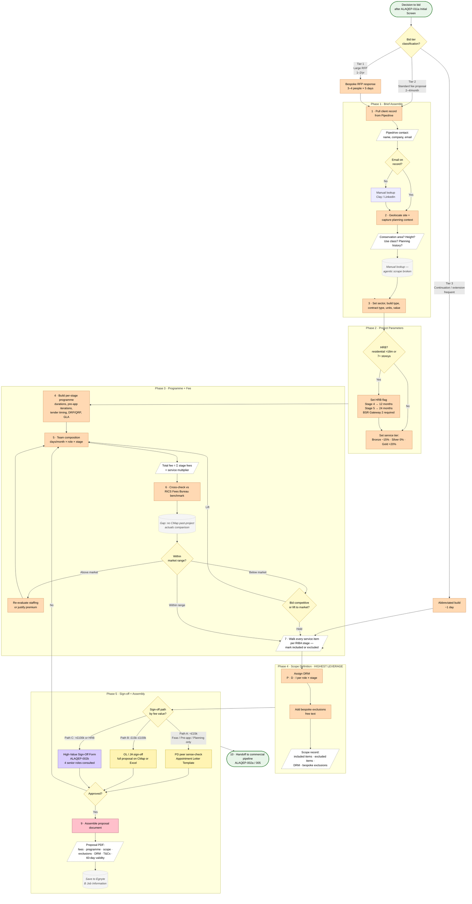

# Fee Proposal Assembly Process (Internal Build of the Bid)

> **Audit source trace:** Oliver Lowrie (`26-05-08-Audit-Leadership-02`, lines 210–266 — full walk-through of the proposal-building process; lines 322–355 — downstream consequences). `ALAQEP-002 Fee Proposal, Fee Sign-Off Policy and Appointment Policy`. `ALAQEP-005 Fee Proposal, Appointment and Client Onboarding Process`. `AL_Fee_Tool.html` (Oliver's solo HTML prototype — evidence of the workflow it is trying to solve, not a step in it).

> **Scope of this workflow:** From "decision to bid" to "proposal ready to send." Covers the internal build only. The commercial pipeline that follows — offer letter, DocuSign, deposit, CMap activation — is ALAQEP-002a / ALAQEP-005.

---

## Roles

| Role | Tag | Involvement |
|---|---|---|
| Senior Directors (JA / OL) | Orange | Primary owners; 95% of bids run through them |
| Technical Director (Wayne) | Pink | ~2 days per bid; keeps fee templates current |
| Project Director (Andrew) | Yellow | ~1 day per bid; internal sense-check |
| Operations Director (Jo Greenoak) | Light Purple | Manages appointment signing and CMap activation once won |
| Finance Manager (Anita) | Blue | CMap invoice schedule; deposit invoice |

---

## Flowchart

**Legend.** Oval = start / end. Rectangle = task (filled by responsible role colour). Parallelogram (dashed border) = data input or output. Diamond = decision. Dotted callout = system note or known gap. Role colours follow ALAQEP convention: Senior Directors (orange) · Technical Director (pink) · Project Director (yellow) · Operations Director (light purple) · Finance Manager (blue) · start/end (green).

---

## Bid Tier Decision (Pre-workflow Gate)

Before assembly begins, the directors classify the bid. Tier determines effort and process.

| Tier | Type | Frequency | Effort | Process |
|---|---|---|---|---|
| **Tier 1** | Large RFP | 1–2/year | 3–4 people × 5 days (~120–160 senior hrs) | Bespoke document; full team; Steps 1–10 apply in full |
| **Tier 2** | Standard fee proposal + free feasibility | 2–4/month | 2–4 days total (~50% feasibility, 50% proposal) | Primary volume tier; Steps 1–10 below |
| **Tier 3** | Continuation / extension fee | Frequent | ~1 day | Abbreviated; formal proposal still required |

Steps 1–10 below describe the **Tier 2 standard process** — the primary volume tier.

---

## Workflow

### 1. Lead Context Setup

*Responsible: Senior Director (Oliver)*

- **Task:** Confirm the lead has passed ALAQEP-011a Initial Screen and directors have decided to bid.
- **Task:** Pull client record from Pipedrive — name, company, email, phone. For existing clients, record is already present. For new clients, write in manually and flag for CRM entry. *(L-02 line 232: "I got all of our contacts out of Pipedrive… if it's an existing client, it's already got them in. If not, you write the name in.")*
- **Task:** If no email address on record, look up via external source (e.g., Clay enrichment or manual LinkedIn lookup).
- **Task:** Set project name and reference for the bid.

**Output:** Client + project identity confirmed, contact details complete.

---

### 2. Site Contextualisation

*Responsible: Senior Director*

- **Task:** Record the site address.
- **Task:** Geolocate the site — confirm coordinates, check map for orientation and boundary context.
- **Task:** Gather planning context for the site:
  - Is the site in a conservation area?
  - What is the existing building height / number of storeys?
  - What is the existing use class?
  - Is there recent or pending planning history?
  - **Source:** Planning portal (manual lookup — LPA website, Planning Explorer, or Locate). *(L-02 line 238: a background agentic scrape was built for this — it "did work and it's quite cool" — but is currently broken; manual lookup is the live fallback.)*

**Output:** Site address confirmed, planning context captured.

---

### 3. Project Parameters

*Responsible: Senior Director*

A set of binary and categorical decisions that determine fee complexity and benchmark category.

- **Task:** Set building sector:
  - Residential / Co-living / Student / Hotel / Commercial / Education / Film Studio / Mixed Use
  - For mixed use: set the proportion of each sector (must sum to 100%).
- **Task:** Set build type: **New Build** or **Retrofit** *(retrofit carries a ~+1.4% benchmark uplift per Fees Bureau).*
- **Task:** Set contract type: **Traditional** or **Design & Build** *(D&B benchmarks run ~2.8% lower than traditional per Fees Bureau 2026).*
- **Decision — HRB (Higher-Risk Building)?** Applies to residential / co-living / student buildings over 18m / 7+ storeys (Building Safety Act 2022).
  - *Yes → HRB flag active:* Gateway 2 required; BSR approval before construction; 8–12+ week BSR determination period; detailed fire strategy and structural safety case; resident engagement duties. Stage 4 and construction stage durations and resourcing are significantly extended. *(L-02 line 240)*
  - *No → Proceed standard.*
- **Task:** For residential sectors: set target unit numbers and unit mix (e.g., 20×1B, 20×2B, 8×3B).
- **Task:** Set construction value (£). This is the denominator for benchmark comparison.
- **Task:** Set service level:
  - **Bronze** — core scope only, lean team; fee adjusted −15% from resource total.
  - **Silver** — standard full service; AL's typical offer; no adjustment.
  - **Gold** — enhanced service, extended scope, senior-weighted team; fee adjusted +20%.

**Output:** All project parameters set. Benchmark category, HRB status, service tier confirmed.

---

### 4. Programme Construction

*Responsible: Senior Director*

For each applicable RIBA stage, decide: (a) whether it is in scope, (b) how long it runs, and (c) whether there are special requirements.

#### Stages available:

| Stage | Default duration | Special options |
|---|---|---|
| **Pre-application** | 3 months | Number of pre-app iterations (e.g., 2 submissions); DRP/QRP panel required?; Public consultation required? |
| **Planning Application** | 4 months | GLA pre-app attendance?; Political engagement attendance? |
| **Determination** | 3 months | — |
| **Stage 3 — Developed Design** | 4 months | Tender at Stage 3+ (contractor appointed before technical design)? |
| **Stage 4 — Technical Design** | 6 months (12 months if HRB) | Tender at Stage 4 (contractor appointed after technical design)?; HRB extends to 12 months to accommodate BSR review |
| **Stage 5 — Construction & Handover** | 18 months (24 months if HRB) | — |

- **Task:** Per stage, set duration in months. *(L-02 line 242: "Four months, three months, number of pre-ops, two.")*
- **Task:** Per stage, set stage-specific options (DRP panel, public consultation, tender timing, HRB flags).
- **Task:** Review the programme as a Gantt — confirm sequencing and total duration is realistic relative to the client's brief.

**Output:** Per-stage durations and options locked; programme total confirmed.

---

### 5. Team Composition and Fee Calculation

*Responsible: Senior Director*

For each enabled stage, estimate how many working days per month each role contributes. The fee is the product of time × charge-out rate.

#### Charge-out rates (CMap 2026, London):

| Role | Day rate | Hour rate |
|---|---|---|
| Directors | £960/day | £120/hr |
| Senior Architects | £720/day | £90/hr |
| Architects | £640/day | £80/hr |
| Assistants | £480/day | £60/hr |

- **Task:** Per stage, set days/month per role. *(L-02 line 242: "directors? Yes, one day a month. Senior architects, like five days a month. Assistant, way more than that.")*
- **Fee calculation logic:** `Stage fee = (Dir_days × 960 + SA_days × 720 + Arch_days × 640 + Asst_days × 480) × duration_months`; `Total raw fee = sum of all stage fees`; `Total fee = Total raw fee × service level multiplier`.
- **Task:** Review stage-by-stage fee split against Fees Bureau stage allocation norms:

| Stage group | Bureau benchmark split |
|---|---|
| Stages 0–2 (Brief, Concept & Planning) | 22% of total fee |
| Stage 3 — Developed Design | 19% of total fee |
| Stage 4 — Technical Design | 32% of total fee |
| Stages 5–6 (Construction & Handover) | 27% of total fee |

If a stage fee looks significantly out of line with the bureau split, adjust staffing.

**Output:** Total fee calculated; monthly cost and per-stage breakdown complete.

---

### 6. Benchmark Cross-Check

*Responsible: Senior Director*

Compare the resource-derived fee against RICS Fees Bureau sector benchmarks (% of construction value). *(L-02 line 246: "this then benchmarks it against the fees bureau… the market average is 3.2% of construction, but when I worked it out, I'm almost a whole percent under.")*

#### Fees Bureau benchmark rates (London 2026, by construction value):

| Sector | £250k | £500k | £1M | £2.5M | £5M | £10M+ |
|---|---|---|---|---|---|---|
| Residential / Co-living / Student | 8.4% | 7.9% | 7.3% | 6.6% | 6.0% | 5.5% |
| Hotel | 6.6% | 6.3% | 5.9% | 5.5% | 5.1% | 4.8% |
| Commercial | 6.5% | 6.1% | 5.6% | 5.0% | 4.6% | 4.2% |
| Education | 6.7% | 6.3% | 5.9% | 5.3% | 4.9% | 4.5% |
| Film Studio | 5.2% | 4.8% | 4.4% | 3.9% | 3.5% | 3.2% |

*Retrofit: add ~+1.4% to the applicable rate. D&B: subtract ~2.8% from the applicable rate.*

- **Decision: Is the calculated fee within market range?**
  - *Above market →* Re-evaluate team composition or stage durations. Consider whether a fee premium is justifiable (complexity, specialist expertise, HRB).
  - *Below market →* Decide: bid at the calculated (competitive) rate, or lift to capture margin. *(Oliver's example: came in ~1% below market — a deliberate competitive choice, not an error.)*
  - *Within range →* Proceed.

> **Gap (L-02 line 222):** The benchmark check uses Fees Bureau percentages only. It does NOT compare against AL's own past project actuals from CMap — "one good way of writing a fee proposal is to look at how much it cost you to deliver the last project that was similar. It doesn't do that currently." Past-project CMap integration is the main missing input at this step.

**Output:** Fee validated against market rate; position (competitive / market / premium) noted.

---

### 7. Scope Definition **(THE HIGHEST-LEVERAGE STEP)**

*Responsible: Senior Director*

Walk through every service item per RIBA stage — mark each as included or excluded. The output of this step is the contractual record that protects AL from scope creep 12 months later.

> **Friction (L-02 lines 262–265):** "If you forget to exclude things that's where it really costs you… Scope defining is the most expensive mistake you've made… it's the biggest problem in the industry." Scope creep occurs on >50% of AL projects. Worst case: £100k fee → £200k staff spend. Oliver: "It's endemic in the industry, not just us."

#### Scope item categories and coverage:

**General Services (all stages):**
- CDM "designer" duties; Building Regulations "designer" duties; Attend Design Team meetings; Act as Lead Designer; Chair Design Team meetings and coordination workshops; Lead on consultant/sub-contractor design integration; Update Risk Register; BIM coordination and model management.
- *Bronze includes: core duties, attendance, risk register. Silver adds: Lead Designer role, chairing, BIM, consultant coordination. Gold adds: sub-contractor design integration.*

**Pre-application & Stage 2 — Concept Design:**
- Site visits; establish client vision and objectives; develop Initial Project Brief and feasibility studies; site analysis and options; liaise with planning consultant; concept design (plans/sections/elevations); design rationale visuals; initial consultant coordination (Structural/MEP); sustainability and energy approach; PPA engagement documents; integrate feedback.
- *Bronze: core deliverables. Silver adds: visuals, consultant coordination, sustainability, PPA documents. Gold adds: in-house visualisations (3 no.).*

**Planning Application & Determination:**
- Prepare planning application documents with planning consultant; integrate engagement feedback; GA plans/sections/elevations; Design and Access Statement; apartment/unit area schedules (GIA); respond to planning officer queries; prepare additional determination information; drawing amendments from consultee comments; determination allowance (capped £7,500).
- *Bronze: all core planning deliverables. Silver adds: determination fee allowance, GLA pre-app attendance. Gold adds: political engagement meeting attendance.*

**Stage 3 — Developed Design:**
- Validate Stage 2 information for buildability/compliance; build/update BIM model; agreed BIM strategy and DRM/CDP list; agreed design programme; refine interior design; develop a single agreed design for all apartments; agree key strategies (MEP, Acoustics, Fire); GA plans/elevations/key sections; resolve key interface conditions; freeze spatial design; coordinate all disciplines spatially; outline project specification; initial Building Control application support; compliance audits; coordinate with cost consultant (Stage 3 cost plan).
- *Bronze: core model and design deliverables. Silver adds: BIM strategy, DRM, programme, interior design, spatial coordination, specification, compliance audits. Gold adds: no additional items at this stage.*

**Stage 4 — Technical Design:**
- Prepare Regulation Design Pack (detailed architectural drawings); GA plans/sections/elevations/fire strategy overlays; key construction details (wall build-ups, compartmentation); schedule of building materials, products and systems with performance data; coordinate with Principal Designer's Fire Safety Information Summary; develop detailed schedules; prepare specifications; liaise with Principal Designer; respond to BSR comments during determination; tender package (Stage 4a); review/comment on sub-contractor packages (Stage 4b); update design for sub-contractor changes (Stage 4c); prepare final construction information (Stage 4c); coordinate final architectural packages with design team (Stage 4c).
- *Bronze: core drawings, details, schedules, fire summary. Silver adds: materials schedule, specifications, BSR responses, tender package, sub-contractor review and coordination, final coordination. Gold adds: lead on coordinating sub-contractor designs as part of design team (Stage 4b).*

**Stage 5 — Construction & Handover:**
- Respond to site RFIs; monthly site visits for visual inspection; attend monthly design team workshop (chaired by Contractor); Practical Completion inspection and certification; handover documentation and H&S File input.
- *Bronze: core responses and inspections. Silver adds: Lead Designer role in construction coordination, snagging inspections, Defects Liability Period inspections. Gold adds: review of shop drawings; post-occupancy evaluation (Stage 7).*

**Additional Items (always excluded unless specifically agreed and priced):**
- Planning conditions discharge (£500/condition); Secured by Design Application (£3,000); conveyancing plans (£250/unit); marketing plans/stripped-out plans (£250/unit); physical model procurement; Principal Designer (CDM) role; Principal Designer (Building Regulations) role; success fee on planning grant; travel outside M25 (recharged at cost); physical printing (at cost + 10%).

**Design Responsibility Matrix (DRM):**
- **Task:** Assign P (Prescriptive) / D (Descriptive) / I (Indicative) to each role per RIBA stage for each discipline. Pre-populated defaults reflect the selected service level and contract type — override as required. *(ALAQEP-002 §6.4 requires the fee proposal to accurately reflect responsibilities.)*

**Bespoke exclusions:**
- **Task:** Add any project-specific exclusions in free text — anything not covered by the standard checklist above. *(L-02 line 248: "in-house visualisations not included", "critical engagement not allowed")*
- **Task:** Review the exclusions list as the final step. This is the document the team will refer back to 12 months later to defend against scope creep.

**Output:** Full scope record — included items, excluded items, DRM responsibilities, bespoke exclusions. This is the contractual spine of the appointment.

---

### 8. Internal Sign-Off

*Responsible: Project Director / Senior Director (per tier)*

- **Path A — Sub-£15k (Feasibility / Pre-app / Planning App only):** Peer sense-check by Project Director sufficient. Template email with fee, scope, PI cover and programme duration. Full appointment template not required — use Appointment Letter Template. *(ALAQEP-002 §6.6–6.7)*
- **Path B — £15k–£100k:** OL / JA sign-off required (in meeting or over email). Full fee proposal on CMap or Excel template. *(ALAQEP-002 §6.8)*
- **Path C — >£100k or HRB:** High-Value Sign-Off Form ALAQEP-002b required. All four senior roles must be consulted: Senior Directors (JA + OL), Operations Director (Jo), Technical Director (Wayne). Outcome and considerations recorded on form. *(ALAQEP-002 §7.1–7.2)*

**Gate:** Approved fee proposal, ready to send.

---

### 9. Proposal Document Assembly

*Responsible: Senior Director / Technical Director*

- **Task:** Compile proposal document containing:
  - Client name, company, site address, project reference
  - Service level (Bronze/Silver/Gold)
  - Programme overview (per-stage durations, Gantt)
  - Per-stage fee breakdown
  - Total fee (excl. VAT and expenses)
  - Scope of services included
  - Explicit exclusions
  - DRM (if applicable)
  - Standard terms and conditions (Trowers & Hamlins)
  - Proposal validity period (60 days from issue date)
- **Task:** Save proposal document in Egnyte project folder — B Job Information. *(ALAQEP-002 §6.11)*

**Output:** Formatted fee proposal document, saved and ready to issue.

---

### 10. Handoff to Commercial Pipeline

- **Status:** Proposal complete — pass to `ALAQEP-002a / ALAQEP-005` "Send offer letter, fee proposal and T&Cs to the client, introducing the OD and FM."
- **Required downstream actions (not part of this workflow):** DocuSign appointment via OD (Jo); deposit invoice via FM (Anita); CMap project activation; CMap invoicing schedule and resource schedule population; onboarding form completion; credit check for new limited company clients.

---

## Data Sources

| Source | What it provides | Status |
|---|---|---|
| **Pipedrive** | Client contact records | Live; manual entry for new contacts |
| **Planning portal (LPA website / Planning Explorer)** | Site planning context | Manual lookup; agentic scrape prototype built but currently broken |
| **RICS Fees Bureau (2026)** | Sector benchmark rates; stage fee split percentages | Built into calculation logic; refreshed annually |
| **CMap charge-out rates** | Staff day rates for fee calculation | Confirmed rates: Dir £960, SA £720, Arch £640, Asst £480/day |
| **CMap past project actuals** | Comparable project fee and hour actuals | **Gap — not yet integrated.** "One good way of writing a fee proposal is to look at how much it cost you to deliver the last project that was similar." *(L-02 line 222)* |
| **Egnyte (B Job Information)** | Proposal storage | Manual file; no auto-save |

---

## Friction Points

| # | Description | Impact |
|---|---|---|
| F1 | No past-project comparable lookup from CMap — fee validation relies on Bureau benchmarks only, not AL's own actuals | Under-pricing risk; missed margin |
| F2 | Planning context scrape is broken — directors manually visit planning portals for each bid | ~30 min per bid of avoidable lookup |
| F3 | Scope definition is entirely in one director's head between bids — no structured checklist enforced in practice | Scope creep on >50% of projects; worst case £100k loss per project |
| F4 | DRM is set once at proposal but is a dead PDF — no live link to project execution or invoicing | DRM disputes unresolvable without surfacing the original signed document |
| F5 | CMap entry (invoicing schedule + resource schedule) is manual post-win step, not connected to the bid data already assembled | Duplication of effort; entry errors |

---

## Cross-References

- `ALAQEP-002a / 005 Fee Proposal, Appointment and Client Onboarding Process` — this workflow sits inside the "Produce high level fee proposal" step (Path B) and reuses Path A for sub-£15k cases.
- `ALAQEP-002b High Value Fee Sign Off Form` — gate at Step 8 for >£100k or HRB.
- `ALAQEP-011a Client Enquiry Initial Screen` — precedes Step 1.
- `MOL-W03 Weekly Operations and Cashflow Cycle` — downstream consumer; invoice-release decisions are only as enforceable as the scope clarity established in Step 7.
- `MOL-W02 Project Kickoff and Brief Capture` — anchor brief takes precedence over fee-proposal scope where they diverge; reconcile at kickoff.

---

## Open Questions

1. Past-project comparable data — what does Oliver need from CMap exactly? Stage-by-stage fee actuals, hours actuals, profitability? Determines the CMap integration spec for Phase 1. **→ Acceptable unknown — defer to Phase 1 scoping.**
2. AL_Fee_Tool.html breakage pattern — "about two days later one of the bits breaks and it never works again" (L-02 around the live demo). The planning scrape endpoint is one known failure mode. What else breaks? Determines whether to rebuild, wrap, or replace. **→ Felipe to inspect HTML/JS directly.**
