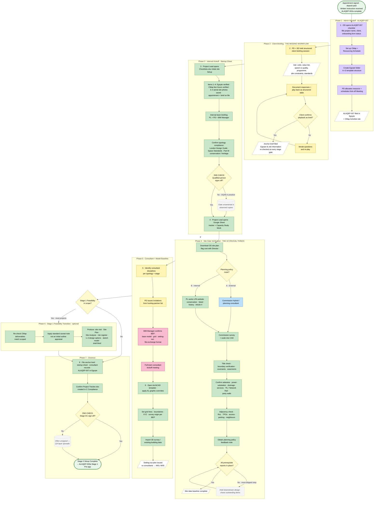

# Project Kickoff and Brief Capture Process (Stage 0 Setup)

> **Audit source trace:** Oliver Lowrie (`26-05-08-Audit-Leadership-02`, lines 380–392 — "10 crucial things… not really written down"; brief playback; OS download; survey; consultant onboarding) · Alahni Brown (`26-05-07-Audit-Team-02`, line 50 — startup sheet, internal briefing, BEP plan; line 58 — initial site plan, grid lines, setting out) · Biyi Sogbesan (`26-05-06-Audit-Team-01`, line 114 — early feasibility flow) · **`ALAQEP-007 Project Set Up Checklist`** (admin layer — CMap/Egnyte/Tracker/Kickoff Mtg) · **`Checklists.xlsx`** (design-side master checklist; Stage 0/1 Capacity Study + Initial Job Setup + Feasibility blocks govern this workflow's design content; resolves Open Question #1 — this **is** the "AL Startup Sheet" Alahni references). Picks up *immediately after* `ALAQEP-002a Fee Proposal, Appointment and Client Onboarding` ends at "Commence work" and complements (does not replace) the admin-side ALAQEP-007.

## Roles
*   **Senior Directors (JA / OL)** (Orange)
*   **Project Director** (Yellow) — primary owner of the project from kickoff
*   **Project Lead / Architect** (Green) — runs day-to-day kickoff activity
*   **Client** (Pink)
*   **Operations Director / EA** (Light Purple) — admin handoff from ALAQEP-002a. **Confirmed (2026-05-13): Jo Greenoak** (jo@ackroydlowrie.com).
*   **External Consultants** (Light Blue) — structural, MEP, planning, survey, etc.
*   **BIM Manager** (Pink-2) — model template and BEP plan owner
*   **Qualified Person / Senior Architect** (Yellow) — performs the `2ND CHECK` QA sign-off at each stage gate per `Checklists.xlsx`

## Flowchart

**Legend.** Oval = start / end. Rectangle = task (filled by responsible role colour). Parallelogram (dashed border) = data input or output. Diamond = decision. Dotted callout = system note or known gap. Role colours: Senior Directors (orange) · Project Director (yellow) · Project Lead (green) · Operations Director (light purple) · BIM Manager (pink) · External Consultants (light blue) · start/end (green oval).

---

## Workflow

### 1. Handoff from Appointment (ALAQEP-007 admin trigger)
*   **Start:** ALAQEP-002a complete — appointment signed via DocuSign, deposit paid, **Written Instruction Received** *(ALAQEP-007 trigger field)*.
*   **Task:** Operations Director opens `ALAQEP-007 Project Set Up Checklist` and completes: Form Completed By, Date, Project Name, Client, Client Onboarding Form Completion (if relevant), DocuSign Template Prepared (if relevant). (Responsible: Operations Director — Jo Greenoak)
*   **Task:** Set up CMap with accurate information; populate CMap Resourcing Schedule. (Responsible: Operations Director)
*   **Task:** Create Egnyte folder using AL standard A–G structure from `standard documents/templates/folder structure/job template`; transfer any pre-instruction material from `Job Folders/Z-potential jobs/` (Responsible: Operations Director) *(Checklists.xlsx — Initial Job Setup §1)*
*   **Task:** Allocate appropriate resource; schedule Kick-off Meeting. (Responsible: Project Director)
*   **Task:** File the completed ALAQEP-007 form in the project Egnyte folder **and** on the CMap Activities tab. (Responsible: Operations Director)
*   **Gate:** Internal Project Kickoff scheduled; written instruction filed; CMap live; Egnyte folder created.

### 2. Client Briefing Session (THE MISSING WORKFLOW PER OLIVER)
*   **Task:** Hold a structured briefing meeting with the client — go beyond the rough bid-stage sketch (Responsible: Project Director + Senior Director if value warrants)
*   **Task:** Ask a structured set of questions (Responsible: Project Director) — *(Oliver L-02 lines 384–386):*
    *   Target unit count and value tier (high-value / low-value)
    *   Speed vs. quality trade-off priority
    *   Maximum planning units OR unit size — which outcome dominates?
    *   Programme constraints (key milestones, financial close, planning submission target)
    *   Site-specific constraints already known to the client
    *   Any particular standard required (NHBC, BREEAM, HRB, other) *(Checklists.xlsx — Stage 4 §2; surface early)*
*   **Task:** Document client responses (Responsible: Project Director / Project Lead)
*   **Task:** "Play back" the answers to the client in a structured table for sign-off (Responsible: Project Director) *(Oliver L-02 line 386: "I'm gonna play back to you what you just said… It spits you out like a kind of table. And they're like, okay, that's the brief.")*
*   **Decision:** Did the client confirm the playback as the brief?
    *   *Yes* -> Capture as the project's anchor brief; file in Egnyte `B Job Information`. This brief will be re-checked at every subsequent stage gate (Stage 3 review re-confirms it explicitly — `Checklists.xlsx` Stage 3 §1–2).
    *   *No* -> **Task:** Iterate questions and re-play (Responsible: Project Director)

> **Friction (Oliver, L-02 line 386):** "Often what's always about getting things like, 'I'll ask a load of questions,' and then it's like, 'Okay, I'm gonna play back to you what you just said.' And it spits you out like a kind of table… that's something that we don't do enough of is like, a really thorough briefing process that will then act as your guide for the rest of the project."

### 3. Internal Project Kickoff (Startup Sheet = Checklists.xlsx Initial Job Setup)
*   **Task:** Project Lead opens the AL Startup Sheet (`Checklists.xlsx` — Stage 0/1 Initial Job Setup block) and works through items 1–4: (1) Egnyte folder set up to AL standard structure; (2) CMap job set up with hours and fee proposal — verify with accounts (Anita) or Director; (3) Locate site by postcode/address and save **3–4 aerial / bird's-eye 3D photographs** from Apple Maps or Google Maps to Egnyte; (4) Confirm detail of appointment, deliverables, and any brief is on file. (Responsible: Project Lead) *(Alahni T-02 line 50: "we'll have to go through all the consultant information go through our startup sheet of do we have all the right information")*
*   **Task:** Internal team briefing — Project Lead, Project Director, BIM Manager (and assistants if assigned) review brief + startup sheet (Responsible: Project Lead)
*   **Task:** Confirm typology-specific compliance baseline that will apply (London Design Guide, National Space Standards, Part M, Building Regs, conservation/heritage) (Responsible: Project Lead) *(Alahni T-02 line 66)*
*   **Gate:** `2ND CHECK` — Qualified person date-stamps the Initial Job Setup section of `Checklists.xlsx`. *(Checklists.xlsx — every stage block ends with a `2ND CHECK / Date / Qualified person` row; this is the standing QA gate.)*

### 4. Site Data Verification (THE 10 CRUCIAL THINGS — OLIVER, reconciled with Checklists.xlsx)
Per Oliver L-02 lines 388–390 reconciled with `Checklists.xlsx` Stage 0/1 Capacity Study (items 2, 3, 4, 8). Confirmed 2026-05-13: Oliver shared a Google Sheet tracker (may not be current version) as the home for these items; the items below match what he confirmed and overlap with the design-side checklist. **ALAQEP-007** covers the parallel admin/systems setup layer (CMap, Egnyte, Tracker, Kickoff Mtg — see §1 above). Each site data item is required before design progresses past Stage 0:

*   **Task:** Download Ordnance Survey site plan — **flag cost with Director before purchase** (Responsible: Project Lead) *(Checklists.xlsx — Capacity Study §2: "Download OS map [if agreed with director — this has a cost]")*
*   **Task:** Check with client or other party whether any existing asset information is available (Responsible: Project Lead) *(Checklists.xlsx — Capacity Study §2)*
*   **Decision:** Planning policy route — (A) commission Hybrid (or other) planning consultant for planning review **OR** (B) Project Lead works the local authority website directly (Responsible: Project Director chooses route) *(Checklists.xlsx — Capacity Study §3)*
    *   If route B: confirm conservation area, listed status, planning history (site + adjacent), Article 4 / other directions in force.
*   **Task:** Commission survey (measured/topo) — and/or obtain suitable floor plan (OS, topo, asset plans, traced from third-party planning drawings); scale into CAD (Responsible: Project Lead) *(Checklists.xlsx — Capacity Study §4)*
*   **Task:** Confirm title check — boundary as drawn matches as deeded; flag any restrictive covenants, easements, ransom strips (Responsible: Project Director — confirm with client / their legal advisors) *(Checklists.xlsx — Pre-app §5: same check is required again before pre-app; doing it now prevents rework)*
*   **Task:** Verify boundary accuracy against site as surveyed (Responsible: Project Lead)
*   **Task:** Confirm asbestos report obtained or commissioned (Responsible: Project Lead)
*   **Task:** Confirm power connection status and substation location/availability (Responsible: Project Lead)
*   **Task:** Confirm existing infrastructure mapped — drainage, services (buried + overhead), party walls, TfL / Network Rail adjacency, overhead cables (Responsible: Project Lead) *(Checklists.xlsx — Capacity Study §8 + Pre-app §6 "Sense check")*
*   **Task:** Adjacency / context check — neighbouring buildings, construction access, site levels, car/cycle parking, trees (TPO check), Right of Light / Daylight, Party Wall matters; decide whether anyone else needs consulting at this stage (Responsible: Project Lead) *(Checklists.xlsx — Capacity Study §8)*
*   **Task:** Obtain planning feedback note on relevant policies from Hybrid or other planning consultant (Responsible: Project Lead) *(Checklists.xlsx — Capacity Study §5; required for feasibility transition)*
*   **Decision:** Are all prerequisite reports in place?
    *   *Yes* -> Proceed to consultant onboarding and model baseline.
    *   *No* -> **Task:** Hold downstream design work; chase outstanding items (Responsible: Project Lead) — *Note: per Oliver, this is the step most often skipped, causing repeat mistakes across projects.*

> **Friction (Oliver, L-02 lines 390–392):** "It's the same on every project. It's not really written down. Well, we've tried to write it down before, but then it just lives in a dark, dead place that nobody checks. So it's like, how do you bring that to life on every project? How do you make sure those steps are followed every time… we still managed to kind of make the same mistakes on every project."

### 5. Consultant Onboarding
*   **Task:** Identify required consultant disciplines (structural, MEP, planning, fire, sustainability, ecology/bats, daylight/sunlight) per typology and stage (Responsible: Project Lead)
*   **Task:** Issue invitations to consultants from AL hunting-partners and historical list (Responsible: Project Director) *[Intel summary notes consultant database is "tribal — no maintained list"]*
*   **Task:** Confirm BEP Plan (BIM Execution Plan) — agree base model, grid origin, setting-out point, file exchange format (Responsible: BIM Manager) *(Alahni T-02 line 58: "the BEP plan… that is a key defining document")*
*   **Task:** Hold full-team consultant kickoff meeting (Responsible: Project Lead)

### 6. Model Baseline Establishment
*   **Task:** Open ArchiCAD template; apply AL template (graphic overrides, view sets per stage) (Responsible: BIM Manager / Project Lead)
*   **Task:** Set up grid lines, boundaries, XYZ coordinates, survey origin per BEP (Responsible: BIM Manager) *(Alahni T-02 line 54)*
*   **Task:** Import any 3D survey or existing-building data (Responsible: BIM Manager)
*   **Task:** Issue setting-out / reference plan to consultants (Responsible: Project Lead) — feeds `MOL-W05 Consultant Coordination`.

### 7. Stage 1 Feasibility Transition (optional gate — only if Feasibility is in scope)
If the appointment includes a paid Stage 1 Feasibility (most AL projects do), the kickoff folds directly into it. Per `Checklists.xlsx` — Stage 1 Feasibility:
*   **Task:** Re-check deliverables on the CMap appointment match what was scoped (Responsible: Project Lead) *(Stage 1 Feasibility §1)*
*   **Task:** Apply the standard "not an initial outline appraisal" caveat note to all feasibility outputs (Responsible: Project Lead) *(Stage 1 Feasibility §4 — standard note exists in AL templates)*
*   **Task:** Produce feasibility outputs — site visit, Site Plan, Site Analysis Diagram, site photos, planning/heritage note, risk register (contamination, trees, overlooking, access, acoustics, rights of light, other), 1–3 design options with sketch concepts, basic 3D model (not rendered), **draft "Brief"** (Responsible: Project Lead) *(Stage 1 Feasibility §5)*
*   *Note:* The draft Brief produced here is the document version of §2's playback table — same anchor, formal artefact.

### 8. Kickoff Closeout
*   **Task:** File anchor brief, completed startup sheet, signed consultant onboarding records, ALAQEP-007 in Egnyte project folder (Responsible: Project Lead)
*   **Task:** Confirm `C Compliance/Project Tracker.xlsx` is created and seeded (Responsible: Project Director)
*   **Gate:** `2ND CHECK` — Qualified person signs off the Stage 0/1 block of `Checklists.xlsx` with date.
*   **Status:** Stage 0 Setup Complete — project ready to enter ALAQEP-003a Stage 1 Pre-applications (governed by `ALAQEP-003a Stage Review and QA Process`).

## Tools Used
DocuSign · CMap (replaces legacy WorkflowMax references in `Checklists.xlsx`) · Egnyte (B Job Information, C Compliance, D Team Comms, G Research; folder template at `standard documents/templates/folder structure/job template`) · ArchiCAD · OS MasterMap · Apple Maps / Google Maps (aerial captures) · Email · Google Workspace · Asbestos / survey contractor portals · `ALAQEP-007 Project Set Up Checklist` (admin layer) · `Checklists.xlsx` (design-side master — Capacity Study, Initial Job Setup, Feasibility blocks for this workflow; later stage blocks govern `MOL-W05`, technical design QA, handover).

## Cross-References
*   `ALAQEP-002a Fee Proposal, Appointment and Client Onboarding Process` — immediate predecessor; ends at "Commence work" which is this workflow's start.
*   `ALAQEP-007 Project Set Up Checklist` — admin/folder/team setup; integrated into §1 above.
*   `Checklists.xlsx` — design-side master checklist; Stage 0/1 Capacity Study + Initial Job Setup + Feasibility blocks govern this workflow. Subsequent blocks (Pre-app, Planning, Stage 3, Technical Design, Windows, Basement, Site, Fabrication, Pre-handover, Record, Defects) govern downstream stages and are referenced by `ALAQEP-003a`.
*   `ALAQEP-003a Stage Review and QA Process` — immediate successor at Stage 1 gate; consumes the anchor brief from §2 and the feasibility outputs from §7.
*   `MOL-W05 Consultant Coordination and RFI Tracking` — operational handoff once consultants are onboard.
*   `MOL-W01 Fee Proposal and Appointment Assembly` — defines the scope/DRM that this workflow must operationalize; brief playback (§2) reconciles against fee-proposal scope.

## Open Questions
1.  ~~Where does the AL Startup Sheet currently live~~ **RESOLVED (2026-05-14):** Startup Sheet = the "Stage 0/1 Initial Job Setup" block in `Checklists.xlsx` (Resources/Checklists.xlsx). Same artefact Alahni references. Consistency of use is the live question — the `2ND CHECK / Qualified person` rows are largely blank in observed copies, suggesting the QA gate is sporadically applied.
2.  ~~The "10 crucial things"~~ **RESOLVED (2026-05-13).** Two-layer confirmed (ALAQEP-007 admin + Checklists.xlsx / Google Sheet tracker design-side). Items in §4 directionally confirmed.
3.  Who owns the title check — internal or external (solicitor)? *(Checklists.xlsx Pre-app §5 says "check with client / their legal advisors" — implies client-side legal, AL coordinates.)*
4.  Is there a standard consultant onboarding email template? *(None located.)*
5.  Average duration from "Commence work" to "Stage 1 ready" — currently unmeasured; needed for ROI scoping.
6.  Is the `2ND CHECK / Qualified person` gate in `Checklists.xlsx` actually enforced today, or is the column ornamental? Material to whether the QA layer is a real control or a documented-but-skipped step (parallels Oliver's "lives in a dark, dead place" friction).
