# Weekly Operations and Cashflow Cycle (Resourcing → Profitability → Invoice Release)

> **Audit source trace:** Jon Ackroyd (`26-05-06-Audit-Leadership-01`, lines 105–122 — CMap dual-tab walkthrough, Kentish Town example; lines 153–165 — "mega spreadsheet" cashflow model, weekly cadence, June dip, 106% collections rate) · Oliver Lowrie (`26-05-08-Audit-Leadership-02`, lines 290–355 — weekly finance meeting, end-of-month invoice-release meeting, knowledge-in-heads pattern; line 322 — weekly cadence confirmed) · Joe Maguire (`26-05-07-Audit-Team-03`, lines 58, 138 — timesheet looseness, "talking not doing" resourcing time). Complements `ALAQEP-003 Project Resourcing Policy` and picks up *upstream* of `ALAQEP-010a Invoicing, Credit Control and Debt Collection`.

> **Scope of this workflow:** The single weekly cycle that the directors run to keep the practice solvent — resourcing decisions, project profitability spot-checks, cashflow refresh, weekly finance meeting, and the month-end invoice-release gate. Previously mapped as two separate workflows (resourcing vs. cashflow); the audit confirmed they share cadence, attendees, central tool (CMap + Xero + Jon's spreadsheet), and decision chain. At-risk-project flags from the resourcing review are the direct input to invoice-release decisions.

---

## Roles

*   **Senior Directors (JA / OL)** (Orange) — primary owners of the full cycle
*   **Operations Director** (Light Purple) — **Jo Greenoak** (jo@ackroydlowrie.com)
*   **Finance Manager** (Blue) — **Anita** (Xero, aged debt, invoicing)
*   **Project Directors** (Yellow) — own individual projects; brought into the invoice-release gate
*   **Project Architects / Team** (Light Blue) — fill in CMap workload + timesheets
*   **External Accountant** (Pink) — Matt Ellis / LFM, board context

---

## Flowchart

```mermaid
flowchart TD
    Start([Week opens · Monday]) --> S1

    subgraph PHASE1[Phase 1 · Inputs Refresh · throughout the week, close by Thursday]
        S1[1 · Each team member updates<br/>CMap workload schedule<br/>red · orange · green]
        S1 --> S1a[PDs log timesheets in CMap<br/>typically Friday]
        S1a --> S1b[(Andrew may pre-populate<br/>forward week — Joe T-03:<br/>'pretty loose')]
        S1b --> S1out[/CMap Workload + Timesheets<br/>refreshed/]
    end

    PHASE1 --> S2

    subgraph PHASE2[Phase 2 · Cashflow Refresh · Jon solo · ~1–2 hrs]
        S2[2 · Jon opens custom<br/>Cashflow spreadsheet]
        S2 --> S2a[Update bank balance ·<br/>predicted income · spend ·<br/>collections rate · VAT logic]
        S2a --> S2b[/Forward ending-balance<br/>per week + per month/]
        S2b --> S2c[Compare predicted vs actual<br/>collections · currently 106%]
    end

    PHASE2 --> S3

    subgraph PHASE3[Phase 3 · Thursday Resourcing Review]
        S3[3 · Open CMap Workload tab ·<br/>review red / orange cells]
        S3 --> S3a[SD + PDs discuss<br/>who moves on/off projects]
        S3a --> S4[4 · Open CMap Finance tab<br/>in parallel · target ~£150k/qtr]
        S4 --> S4a[Manually correlate<br/>capacity ↔ revenue]
        S4a --> S4dec{Capacity-to-revenue<br/>ratio acceptable?}
        S4dec -->|No| S4adj[Adjust assignments ·<br/>pause / accelerate projects]
        S4adj --> S3a
        S4dec -->|Yes| S5
    end

    subgraph PHASE4[Phase 4 · Per-Project Profitability]
        S5[5 · For at-risk projects ·<br/>open project-level CMap view]
        S5 --> S5a[/Read: value · % progress ·<br/>expected profit · invoiced ·<br/>paid · time-cost-to-date/]
        S5a --> S5dec1{Self-reported %<br/>matches reality?}
        S5dec1 -->|Mismatch| S5flag1[Flag for project review ·<br/>renegotiate additional fee]
        S5dec1 -->|Match| S5dec2
        S5flag1 --> S5dec2{Invoiced converging<br/>on total fee with<br/>work remaining?}
        S5dec2 -->|Underwater| S5flag2[Add to invoice-release<br/>watchlist · fee variation talk]
        S5dec2 -->|Healthy| S6
        S5flag2 --> S6
        S6[6 · Locate Google Sheet<br/>tracker · C Compliance]
        S6 --> S6dec{Tracker up to date<br/>with sign-offs / regs / CDM?}
        S6dec -->|No| S6flag[(Reporting flawed —<br/>tracker decay observed,<br/>not enforced)]
        S6dec -->|Yes| S7
        S6flag --> S7
    end

    PHASE3 --> PHASE4
    PHASE4 --> PHASE5

    subgraph PHASE5[Phase 5 · Weekly Finance Meeting · 1 hr · 4 people]
        S7[7 · JA + OL + Jo + Anita<br/>weekly finance meeting]
        S7 --> S7a[Review cashflow forecast<br/>vs actuals]
        S7a --> S7b[Identify unsent invoices +<br/>outstanding debtors]
        S7b --> S7c[Discuss collections strategy]
        S7c --> S7dec{Per project ·<br/>release this month?}
        S7dec -->|Yes| S7rel[/Add to month-end<br/>release list/]
        S7dec -->|Hold| S7hold[Record reason for hold ·<br/>currently undocumented]
        S7rel --> S8
        S7hold --> S8
    end

    subgraph PHASE6[Phase 6 · Ad-hoc Debt Chasing]
        S8[8 · JA + OL direct outreach<br/>to overdue clients ·<br/>~0.5–1 hr/wk each]
    end

    PHASE5 --> PHASE6
    PHASE6 --> S9

    subgraph PHASE7[Phase 7 · End-of-Month · THE DECISION GATE]
        S9[9 · End-of-month invoice<br/>release meeting]
        S9 --> S9a[Walk every pending invoice<br/>SDs + PDs]
        S9a --> S9dec{Release this<br/>invoice?}
        S9dec -->|Release| S9rel[Confirm with FM to issue<br/>→ ALAQEP-010a §1]
        S9dec -->|Hold| S9why{Why on hold?}
        S9why -->|Work not delivered| S9w1[Loop to PD<br/>for completion]
        S9why -->|Client non-payment reason| S9w2[Loop to MOL-W05 RFI<br/>resolve delivery issue]
        S9why -->|Director-personal relationship| S9w3[(Held by SD knowledge ·<br/>SPOF · undocumented)]
        S9w1 --> S9a
        S9w2 --> S9a
        S9w3 --> S10
        S9rel --> S10
    end

    subgraph PHASE8[Phase 8 · Forecast Reconciliation]
        S10[10 · Jon updates cashflow<br/>realised vs forecast]
        S10 --> S10a[Adjust forward forecast<br/>3–12 months]
        S10a --> S10dec{Forward cashflow<br/>within risk thresholds?}
        S10dec -->|No| S10flat[Flatten the curve manually ·<br/>budget · pacing · deferral]
        S10flat --> S10a
        S10dec -->|Yes| S11
    end

    subgraph PHASE9[Phase 9 · Monthly Board Pack]
        S11[11 · FM pulls Xero exports ·<br/>reconciles with CMap ·<br/>Futurli P&L deck]
        S11 --> S11a[FM appends performance<br/>observations]
        S11a --> S11b[Send to board ahead<br/>of monthly meeting]
    end

    PHASE9 --> End([Cycle closed ·<br/>weekly + monthly])

    classDef startEnd fill:#E8F5E9,stroke:#2E7D32,stroke-width:2px,color:#000
    classDef sd fill:#FFD9B3,stroke:#C97A3A,color:#000
    classDef pd fill:#FFF4B3,stroke:#B89A00,color:#000
    classDef od fill:#D9CCFF,stroke:#6B4FB8,color:#000
    classDef fm fill:#B8D4FF,stroke:#3A66B8,color:#000
    classDef team fill:#BBDEFB,stroke:#1565C0,color:#000
    classDef ext fill:#FFC0CB,stroke:#A04060,color:#000
    classDef io fill:#FFFFFF,stroke:#555,stroke-dasharray:4 3,color:#000
    classDef decision fill:#FFFACD,stroke:#B8860B,color:#000
    classDef note fill:#F5F5F5,stroke:#999,stroke-dasharray:2 2,color:#444,font-style:italic

    class Start,End startEnd
    class S2,S2a,S2c,S3,S3a,S4,S4a,S4adj,S5,S5flag1,S5flag2,S7,S7a,S7c,S8,S9,S9a,S9rel,S10,S10a,S10flat sd
    class S1,S1a team
    class S6 pd
    class S7b,S11,S11a,S11b fm
    class S7hold,S9w1 pd
    class S9w2 pd
    class S1out,S2b,S5a,S7rel io
    class S4dec,S5dec1,S5dec2,S6dec,S7dec,S9dec,S9why,S10dec decision
    class S1b,S6flag,S9w3 note
```

**Legend.** Oval = start / end. Rectangle = task (filled by responsible role colour). Parallelogram (dashed border) = data input or output. Diamond = decision. Dotted callout = system note or known gap. Role colours: Senior Directors (orange) · Project Directors (yellow) · Operations Director (light purple) · Finance Manager (blue) · Team / Architects (light blue) · External Accountant (pink) · start/end (green oval).

---

## Workflow

### 1. Inputs Refresh (Throughout the Week, Closed by Thursday)

*   **Task:** Each team member updates their CMap workload schedule with planned tasks for the coming week — colour-coded red (over capacity), orange (spare capacity), green (balanced) (Responsible: Project Architects / Team) *(Jon L-01 line 105)*
*   **Task:** Project Directors log timesheets in CMap (Responsible: Project Architects / Team — currently weekly, typically Fridays per Joe T-03 line 58)
*   **Task:** Andrew (Associate) may pre-populate forward week assignments on behalf of team (Responsible: Operations Director / Associate) *(Joe T-03 line 58: "Andrew sometimes logs what I'm meant to be doing for the week on it, but it seems pretty loose")*

> **Friction (Joe, T-03 line 58):** Timesheet and workload entry is "pretty loose" — pre-population by a senior creates a passive workforce that does not own its own forecast.

---

### 2. Jon's Weekly Cashflow Refresh (~1–2 hrs, Jon solo)

*   **Task:** Open Jon's custom Cashflow spreadsheet (links to budget sheet with per-staff salary, charge-out rates, memberships, accountancy, travel, marketing) (Responsible: Senior Director — Jon)
*   **Task:** Update weekly inputs: starting bank balance, predicted income (incl. VAT logic per category), predicted spend, collections rate adjustment (Responsible: Senior Director)
*   **Task:** Apply VAT adjustment per expenditure category (some include VAT, some don't — encoded in cells) (Responsible: Senior Director) *(Jon L-01 line 165)*
*   **Task:** Output forward ending-balance per week and per month — flag pinch points (e.g., June 2026 modelled drop from £150k to £7k around tax payments) (Responsible: Senior Director)
*   **Task:** Compare predicted vs. actual collections rate; currently running at 106% (recovering old debt) (Responsible: Senior Director)

> **Friction (Jon, L-01 line 165):** "This is a mega spreadsheet, but it does work. I have to say and if I could… digitize this… it'd be good to kind of make this a bit more dynamic." Annual rebuild required because the model is keyed to a single calendar year and per-staff inputs change. Jon is the sole maintainer.

---

### 3. Thursday Resourcing Review

*   **Task:** Open CMap Workload Schedule tab (Responsible: Senior Director — Jon)
*   **Task:** Review each team member's status — identify red (over-capacity) and orange (spare-capacity) cells (Responsible: Senior Director)
*   **Task:** Discuss who should be moved on/off which project for the coming weeks (Responsible: Senior Director + Project Directors)

> **Friction (Joe, T-03 line 138):** "We spend a lot of time talking about resourcing and who's going to get like what projects need people to work on them and who is going to be good at that project and understanding where to put people which I think is it's a big time sink because you're just talking, you're not doing anything."

---

### 4. Revenue Cross-Check (Manual CMap Dual-Tab)

*   **Task:** Open CMap Finance tab in parallel — confirmed monthly revenue (target ~£150k/quarter) (Responsible: Senior Director) *(Jon L-01 line 105)*
*   **Task:** Manually correlate revenue with capacity — does the planned resource allocation maintain profitability? (Responsible: Senior Director)
*   **Decision:** Are the two tabs aligned (capacity-to-revenue ratio acceptable)?
    *   *Yes* -> Proceed.
    *   *No* -> **Task:** Adjust assignments and/or escalate (e.g., pause a project, accelerate another) (Responsible: Senior Director)

> **Friction (Jon, L-01 lines 105–106):** "the gooey, the user interface is pretty s***… you've got the money over on one tab and you're saying, 'Oh, we're getting 150k in this month.' And then we're going, 'Oh, we need these people.' But it's the two it would be so you really want to know what's the impact of putting all these people are we still making money how much resource can we put… it's not that intelligent — you have to sort of extrapolate that yourself."

---

### 5. Per-Project Profitability Spot-Check

*   **Task:** For at-risk projects, open project-level CMap view (Responsible: Senior Director) *(Jon L-01 lines 109–113 — Kentish Town walk-through)*
*   **Task:** Read off: project value, % progress (self-reported), expected profit, invoiced-to-date, paid-to-date, time-cost-to-date (Responsible: Senior Director)
*   **Decision:** Does the self-reported % progress match reality? *[Kentish Town example: 74% claimed, Jon estimates 65% max]*
    *   *Match* -> Proceed.
    *   *Mismatch* -> **Task:** Flag for project review with Project Director; potentially renegotiate additional fee with client (Responsible: Senior Director)
*   **Decision:** Is invoiced-to-date converging on total fee with significant work remaining? *[Kentish Town: £19k invoiced of £29k total, "loads more work to do"]*
    *   *Healthy* -> Proceed.
    *   *Underwater* -> **Task:** Escalate to fee variation conversation with client + add to invoice-release watchlist (Responsible: Senior Director)

> **Friction (Jon, L-01 line 113):** "it doesn't come up on a dashboard. I've got to go and find it and dig it out and check on it. So, it's a bit kind of lost."

---

### 6. Project Tracker Reconciliation

*   **Task:** For each active project, locate the Google Sheets project tracker in Egnyte (`C Compliance/Project Tracker.xlsx`) (Responsible: Project Director) *[inferred — Jon L-01 line 121: "people sometimes save them in slightly different places"; Egnyte C Compliance sub-folder confirmed in Day-3 data analysis]*
*   **Decision:** Is the tracker up to date with sign-offs, planning conditions, building regs, CDM status?
    *   *Yes* -> Proceed.
    *   *No* -> **Task:** Tracker is incomplete — reporting flawed (Jon: "they're saying they're 75% complete… they still haven't got any sign-offs from building. It's not 75%. It's 50%.") (Responsible: Project Director)

> **Friction (Jon, L-01 line 121):** "people sometimes save them in slightly different places… see it's not completed." Tracker decay is observed but not enforced.

---

### 7. Weekly Finance Meeting (1 hr, four people)

*   **Task:** Hold weekly finance meeting — Jon, Oliver, Jo Greenoak (Operations Director), Anita (Finance Manager) (Responsible: Senior Directors) *(Oliver L-02 line 322)*
*   **Task:** Review cashflow forecast vs actuals (Responsible: Finance Manager + Senior Directors)
*   **Task:** Identify invoices not yet sent and outstanding debtors (Responsible: Finance Manager)
*   **Task:** Discuss collections strategy for overdue payments (Responsible: Senior Directors)
*   **Decision:** Per project, can this invoice be released this month?
    *   *Yes* -> Add to month-end release list.
    *   *No (hold)* -> **Task:** Record reason for hold (Responsible: Operations Director / Senior Director) *[inferred — currently undocumented; lives in directors' heads]*

---

### 8. Ad-Hoc Debt Chasing (Jon + Oliver, ~0.5–1 hr/wk each)

*   **Task:** Direct outreach to clients with overdue invoices — email and phone (Responsible: Senior Directors) *(Oliver L-02 line 322)*

> **Cross-reference:** Once an invoice is issued, post-issuance chasing follows `ALAQEP-010a Invoicing and Credit Control Process` (FM chase → 30-day interest → 7/30-day letter → legal action with ZK).

---

### 9. End-of-Month Invoice Release Meeting (THE DECISION GATE)

*   **Task:** Convene end-of-month meeting to review the full invoice release list against the cashflow target (Responsible: Senior Directors) *(Oliver L-02 line 350: "at the end of the month we'll be like, okay, can all the invoices go out?")*
*   **Task:** Walk through each pending invoice (Responsible: Project Directors + Senior Directors)
*   **Decision:** For each invoice — release this month?
    *   *Release* -> **Task:** Confirm with Finance Manager to issue (Responsible: Senior Director) — picks up `ALAQEP-010a §1 Invoicing Setup`.
    *   *Hold* -> **Decision:** Why is this on hold?
        *   *Work not yet delivered* -> Loops back to Project Director for completion before release.
        *   *Client has raised a non-payment reason* -> Loops back to `MOL-W05 RFI` to resolve the underlying delivery issue.
        *   *Director-personal client relationship reason* -> **Status:** Held by Senior Director knowledge (currently undocumented — single point of failure)

> **Friction (Oliver, L-02 line 350):** "we sit around and just meet and then people are like, oh no, well this can't go out because of this. I didn't move it out. And then there's bits where they're like, oh wait, John needs to say whether this can go out and stuff. And it's like all that knowledge about It should not be." The decision rule lives in JA/OL's heads.

> **Friction (Oliver, L-02 line 352):** "The number at the end of the month always changes a lot because you think you're gonna spend 150, but then people are like, 'Well, loads of shit has not been done,' or like, 'People thought the wrong thing,' and so, you know, 'Oh, God, we didn't send out, like, 130 grand worth of invoices, and then we thought it was 150.'"

---

### 10. Forecast Reconciliation

*   **Task:** After invoice release decisions, Jon updates the cashflow model with realised vs forecast revenue (Responsible: Senior Director — Jon) *[inferred — implicit in the weekly refresh loop]*
*   **Task:** Adjust the forward forecast (next 3–12 months) given any holds, deferrals, or accelerations (Responsible: Senior Director)
*   **Decision:** Is the resulting forward cashflow within acceptable risk thresholds?
    *   *Yes* -> Close cycle.
    *   *No* -> **Task:** Flatten the curve manually (budget adjustments, payment pacing, expense deferral) (Responsible: Senior Director) *(Jon L-01 line 165: "I have flattened that curve and we've been in the black all year")*

---

### 11. Monthly Board Pack Roll-Up

*   **Task:** Finance Manager pulls Xero exports → reconciles with CMap project data → Futurli produces P&L trend deck (Responsible: Finance Manager) *(Jon L-01 line 89)*
*   **Task:** Finance Manager manually appends performance observations (Responsible: Finance Manager)
*   **Task:** Send to board ahead of monthly board meeting (Responsible: Finance Manager)

*   **Status:** Weekly cycle closed; monthly cycle closed at board pack.

---

## Tools Used

CMap (Workload Schedule tab · Finance tab · Project P&L view) · Jon's custom Cashflow spreadsheet (Excel/Google Sheets) · Xero · Futurli (Xero add-on) · Google Sheets (per-project tracker) · Egnyte (C Compliance sub-folder hosting trackers) · Pipedrive (forward sales pipeline context) · Email · Phone.

## Cross-References

*   `ALAQEP-003 Project Resourcing Policy` — parent policy (binary).
*   `ALAQEP-010 Invoicing, Credit Control and Cashflow Policy` — parent policy.
*   `ALAQEP-010a Invoicing and Credit Control Process` — picks up at "Invoice issued through Xero" (Step 9 Release here).
*   `ALAQEP-012 Internal Project Audit & Review Policy` — formal audit; this weekly loop is operational triage between audits.
*   `MOL-W01 Fee Proposal and Appointment Assembly` — root cause of much of the friction here: invoice releaseability depends on appointment clarity (Oliver L-02 line 312: "It all tracks back to your appointment").
*   `MOL-W02 Project Kickoff and Brief Capture` — anchor brief affects scope-creep exposure surfaced at invoice gate.

## Open Questions

1.  Decision-cycle time of the Thursday resourcing meeting — Jon described the activity but did not state a duration. *(Need confirmation — likely 1–2 hrs based on cadence.)*
2.  Who currently owns the action of communicating resourcing changes to the team after the meeting?
3.  Is there a written escalation rule for when red-status persists more than one week?
4.  CMap API write capability — confirmed read via DRS CSV (24-hour lag); write status not confirmed (flagged in Day-3 Data Tool Landscape).
5.  Who attends the end-of-month invoice release meeting beyond Jon, Oliver, Operations Director, Finance Manager? Are Project Directors required? *(Implied yes by Oliver L-02 line 310 but not confirmed.)*
6.  Is there a written invoice-release decision rubric (programme delivered? client up-to-date? scope variation reconciled?) — answer is no per Oliver, but worth confirming.
7.  Annual rebuild of Jon's cashflow spreadsheet — what would unlock a continuous (not annual) model? CMap API write access is the most likely lever.
8.  Collections rate target — 106% current is recovery of old debt; what is the steady-state target?
