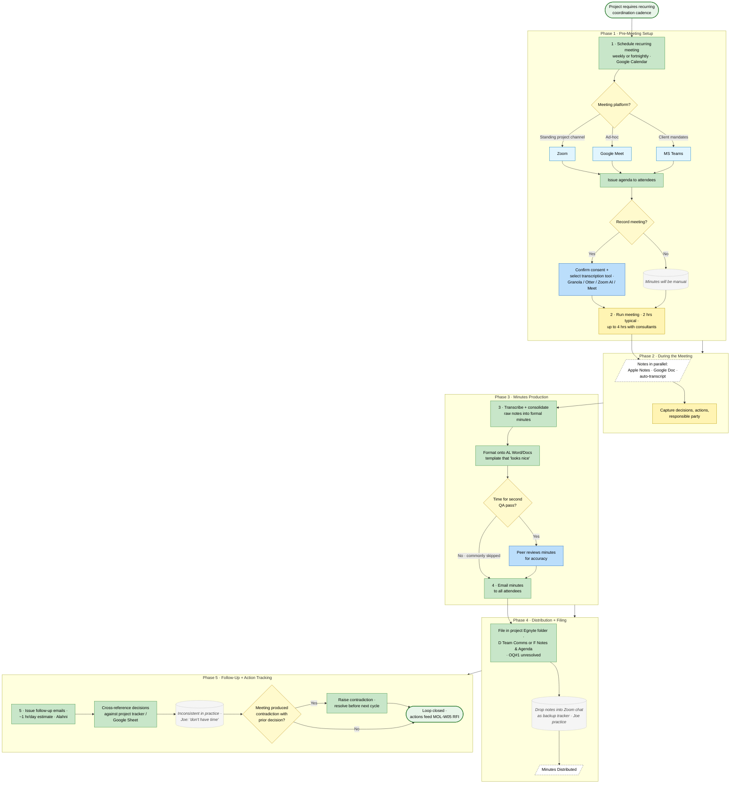

# Coordination Meeting Capture and Distribution Process

> **Audit source trace:** Alahni Brown (`26-05-07-Audit-Team-02`, lines 47–48, 64–66, 78–88) · Joe Maguire (`26-05-07-Audit-Team-03`, lines 38, 42, 50) · Jon Ackroyd (`26-05-06-Audit-Leadership-01`, lines 106–114) · Biyi Sogbesan (`26-05-06-Audit-Team-01`, line 134 — Zoom project chats). Complements `ALAQEP-005 Internal Project Meetings Policy` (policy exists; no process flow document found).

## Roles
*   **Project Lead** (Green)
*   **Meeting Owner / Chair** (Yellow) — usually the Project Lead or a Project Director
*   **Attendees (Consultants + AL Team)** (Light Blue)
*   **Client** (Pink) — when present
*   **Technical Director** (Purple) — when QA sign-off of decisions is required

## Flowchart

**Legend.** Oval = start / end. Rectangle = task (filled by responsible role colour). Parallelogram (dashed border) = data input or output. Diamond = decision. Dotted callout = system note or known gap. Role colours: Project Lead (green) · Meeting Owner / Chair (yellow) · Attendees (light blue) · Client (pink) · Technical Director (purple) · Platform options (sky blue) · start/end (green oval).

---

## Workflow

### 1. Pre-Meeting Setup
*   **Task:** Schedule recurring coordination meeting (weekly or fortnightly depending on project formality) via Google Calendar (Responsible: Project Lead)
*   **Task:** Confirm meeting platform — Zoom for standing project channels, Google Meet for ad-hoc, MS Teams when client mandates (Responsible: Project Lead) *[inferred from Alahni T-02 line 74 — "Google Meets or Zoom or Teams"]*
*   **Task:** Issue agenda to attendees ahead of meeting (Responsible: Project Lead) *[single source — Joe T-03 line 38: "structured meeting programs"; no fixed cadence rule confirmed]*
*   **Decision:** Will the meeting be recorded?
    *   *Yes* -> **Task:** Confirm consent with all attendees and select transcription tool (Granola / Otter / Zoom AI / Google Meet recording) (Responsible: Meeting Owner)
    *   *No* -> Proceed without recording; minutes will be manual.

> **Friction (Jon, L-01 lines 110–114):** "we've got like about 20 different ways… someone's got otter. We just need to kind of consolidate how we produce meeting minutes, ideally automated and with review process. I would like it to be very explicit. Is this a recorded conversation or not and how we can protect against… the legal aspects of when we want to have a private conversation." Tool choice is per-person, not standardised.

### 2. During the Meeting
*   **Task:** Run the coordination meeting — typical duration 2 hours, can extend to 4 hours if multiple consultants need workshop time (Responsible: Meeting Owner) *(Alahni T-02 line 66)*
*   **Task:** Take notes in parallel — typically in Apple Notes (Joe), in a Google Doc, or via auto-transcription if enabled (Responsible: Attendees, Project Lead)
*   **Task:** Capture decisions, action items, and the responsible party for each item (Responsible: Project Lead)

> **Friction (Alahni, T-02 lines 86–88):** Auto-transcription tools "sometimes generate random stuff or they don't really quite understand the context… we can't really rely on that and then sometimes it becomes like a privacy thing too because someone said something in the meeting that they probably shouldn't have said."

### 3. Post-Meeting — Minutes Production
*   **Task:** Transcribe / consolidate raw notes into formal minutes — capture decisions, actions, owners, deadlines (Responsible: Project Lead)
*   **Task:** Format minutes onto AL Word/Docs template so the document "looks nice" (Responsible: Project Lead) *(Jon L-01 line 114)*
*   **Decision:** Is a second QA pass on the minutes time-permitting?
    *   *Yes* -> **Task:** Second set of eyes reviews minutes for accuracy (Responsible: Project Lead or peer) *(Alahni T-02 line 80)*
    *   *No* -> Proceed (commonly skipped under time pressure — Alahni T-02 line 82)

> **Friction (Alahni, T-02 lines 64–66):** "meeting minutes can take depending how long their meeting is can take up to anywhere for like 45 minutes if it's quite thorough and quite detailed."
> **Friction (Joe, T-03 line 38):** "kind of like intermittent phone calls… that can take quite a lot of time like taking formal notes and minutes from meetings. Um sometimes longer than the meeting itself to be honest."

### 4. Distribution and Filing
*   **Task:** Send minutes to all attendees by email (Responsible: Project Lead)
*   **Task:** File final minutes in the project's Egnyte folder (Responsible: Project Lead) *[inferred — no specific sub-folder rule confirmed in sources; ALAQEP-001 Egnyte Folder Structure Policy governs but content not extracted]*
*   **Task:** Drop a copy of notes into the project's Zoom chat as a backup project tracker (Responsible: Project Lead — current practice by Joe) *(Joe T-03 line 50: "I just copy and paste the notes from notes into into the Zoom chat usually to try and like as a tracker of what's happened in meetings if we're not issuing meeting minutes.")*
*   **Status:** Minutes Distributed.

### 5. Follow-Up and Action Tracking
*   **Task:** Issue follow-up emails on individual action items as needed (Responsible: Project Lead — ~1 hour/day estimate by Alahni T-02 line 66)
*   **Task:** Cross-reference any decision against the project tracker / Google Sheet (Responsible: Project Lead) *[inferred — actually carried out inconsistently per Joe T-03 line 42: "I don't do that very regularly usually because I don't have time"]*
*   **Decision:** Did the meeting produce a contradiction with a prior decision?
    *   *Yes* -> **Task:** Raise contradiction to project team; resolve before next coordination cycle (Responsible: Project Lead) *(Joe T-03 line 154: "if they're contradicting themselves, it comes up and tells them the contradiction. Because that happens a lot.")*
    *   *No* -> Close meeting loop.

## Tools Used
Zoom · Google Meet · MS Teams · Granola · Otter · Apple Notes · Google Docs · Word · Email · Egnyte · Google Sheets (project tracker) · Zoom chat (informal tracker).

## Cross-References
*   `ALAQEP-001 Egnyte Folder Structure Policy` — governs minutes filing location.
*   `ALAQEP-005 Internal Project Meetings Policy` — parent policy.
*   `MOL-W05 Consultant Coordination and RFI Tracking` — picks up the action items generated here.

## Open Questions
1.  Which Egnyte sub-folder (D Team Comms? F Notes & Agenda?) is the official minutes home — both exist in the per-project A–G structure but no rule is documented.
2.  Is there an approved AL minutes template? Jon (L-01) references "our Word format or Docs format that looks nice" but no template was located in the Resources pull.
3.  Who is responsible for storing the consent record when a meeting is recorded? (Jon raised the legal exposure; no current owner.)
4.  What is the formal minutes-approval cadence (24h? next meeting?) — not confirmed.
