# Consultant Coordination and Information Request Process

> **Audit source trace:** Biyi Sogbesan (`26-05-06-Audit-Team-01`, lines 124–134) · Alahni Brown (`26-05-07-Audit-Team-02`, lines 50–58, 86–87) · Joe Maguire (`26-05-07-Audit-Team-03`, lines 26–34, 138). No ALAQEP exists for inbound consultant information; `ALAQEP-004 Drawing Issuing Policy` only covers outbound issuance.

## Roles
*   **Project Lead** (Green) — AL architect responsible for project, owns the coordination loop
*   **Architectural Team** (Light Blue) — assistants, technicians supporting the Project Lead
*   **External Consultants** (Orange) — structural engineer, MEP, planning, fire, sustainability, etc.
*   **Client** (Pink) — occasionally part of the loop
*   **BIM Manager** (Yellow) — handles IFC import issues and model coordination

## Flowchart

```mermaid
flowchart TD
    Start([Project Lead identifies a gap<br/>in design information needed<br/>to progress]) --> S1

    subgraph PHASE1[Phase 1 · Request Triggered]
        S1[1 · Confirm whether question<br/>was raised previously in<br/>email thread or meeting]
        S1 --> S1dec{Requested<br/>before?}
        S1dec -->|Yes| S1hunt[Locate prior thread:<br/>search email + Egnyte<br/>· ~1–2 hrs/wk per architect]
        S1dec -->|No| S2
        S1hunt --> S2
    end

    subgraph PHASE2[Phase 2 · Outbound Request]
        S2[2 · Send RFI email:<br/>specific question · project ref ·<br/>deadline]
        S2 --> S2a[Share latest model context:<br/>IFC export from ArchiCAD<br/>or Egnyte folder link]
        S2a --> S2dec{IFC export rendered<br/>correctly on<br/>consultant side?}
        S2dec -->|No · walls hidden| S2fix[BIM Manager re-exports<br/>after engineering review]
        S2fix --> S2dec
        S2dec -->|Yes| S3
    end

    PHASE1 --> PHASE2

    subgraph PHASE3[Phase 3 · Inbound Response + Triage]
        S3[3 · Receive consultant response<br/>via email · attachment, link,<br/>or written answer]
        S3 --> S3a[/Classify by urgency:<br/>directive change · flag · warning/]
        S3a --> S3note[(No shared severity<br/>convention · Biyi T-01 L126)]
        S3note --> S3client{Client clarification<br/>needed?}
        S3client -->|Yes| S3cl[Client confirms priority,<br/>constraint, or brief intent]
        S3client -->|No| S3dec
        S3cl --> S3dec{Response fully<br/>answers RFI?}
        S3dec -->|No| S3fu[Send follow-up email<br/>or schedule call to close]
        S3fu --> S3
        S3dec -->|Yes| S4
    end

    subgraph PHASE4[Phase 4 · Information Integration]
        S4[4 · Incorporate input into<br/>ArchiCAD model · grids ·<br/>structure · MEP · schedules]
        S4 --> S4a[QA cross-reference vs architecture<br/>· clashes · compliance ·<br/>contradictions with prior decisions]
        S4a --> S4b[Log decision + source thread<br/>into Google Sheet tracker]
        S4b --> S4note[(Done inconsistently ·<br/>Biyi: 'tracker not updated' ·<br/>data lost in email)]
    end

    PHASE3 --> PHASE4
    PHASE4 --> S5

    subgraph PHASE5[Phase 5 · Distribution to Wider Team]
        S5[5 · If material to wider project ·<br/>distribute via Zoom chat +<br/>next coordination meeting]
        S5 --> S5a[File consultant document<br/>in Egnyte · C Compliance for regs ·<br/>D Team Comms for general]
    end

    S5 --> S6

    subgraph PHASE6[Phase 6 · Closeout / Recurrence]
        S6[/Information Closed/]
        S6 --> S6dec{Re-confirm at<br/>later RIBA stage?}
        S6dec -->|Yes| S6flag[Flag in tracker for<br/>re-confirmation at<br/>next stage gate]
        S6dec -->|No| End
        S6flag --> End
    end

    End([Loop feeds next coordination<br/>meeting · MOL-W04])

    classDef startEnd fill:#E8F5E9,stroke:#2E7D32,stroke-width:2px,color:#000
    classDef lead fill:#C8E6C9,stroke:#388E3C,color:#000
    classDef team fill:#BBDEFB,stroke:#1565C0,color:#000
    classDef ext fill:#FFD9B3,stroke:#C97A3A,color:#000
    classDef client fill:#FFC0CB,stroke:#A04060,color:#000
    classDef bim fill:#FFF4B3,stroke:#B89A00,color:#000
    classDef io fill:#FFFFFF,stroke:#555,stroke-dasharray:4 3,color:#000
    classDef decision fill:#FFFACD,stroke:#B8860B,color:#000
    classDef note fill:#F5F5F5,stroke:#999,stroke-dasharray:2 2,color:#444,font-style:italic

    class Start,End startEnd
    class S1,S1hunt,S2,S3fu,S4a,S4b,S5,S5a,S6flag lead
    class S4 team
    class S3 ext
    class S3cl client
    class S2a,S2fix bim
    class S3a,S6 io
    class S1dec,S2dec,S3client,S3dec,S6dec decision
    class S3note,S4note note
```

**Legend.** Oval = start / end. Rectangle = task (filled by responsible role colour). Parallelogram (dashed border) = data input or output. Diamond = decision. Dotted callout = system note or known gap. Role colours: Project Lead (green) · Architectural Team (light blue) · External Consultants (orange) · Client (pink) · BIM Manager (yellow) · start/end (green oval).

---

## Workflow

### 1. Information Request Triggered
*   **Start:** Project Lead identifies a gap in design information needed to progress (structural grid, MEP routing, compliance answer, planning condition, etc.) (Responsible: Project Lead)
*   **Task:** Confirm whether the question was already raised previously in an email thread or coordination meeting (Responsible: Project Lead)
*   **Decision:** Has this information been requested before?
    *   *Yes* -> **Task:** Locate prior thread by searching email and Egnyte (Responsible: Project Lead) — *[Friction: information hunting, ~1–2 hrs/wk per architect per Joe T-03 line 34]*
    *   *No* -> Proceed.

### 2. Outbound Request
*   **Task:** Send RFI email to consultant with specific question, project reference, and deadline (Responsible: Project Lead)
*   **Task:** Where formal, share the latest model context — typically as an IFC export from ArchiCAD or as a link to the Egnyte folder (Responsible: BIM Manager / Project Lead) *(Biyi T-01 line 134: "the way we send out our files are for example if a contract if a engineer wants our file would export the model as a IFC")*
*   **Decision:** Did the IFC export render correctly on consultant's side?
    *   *Yes* -> Proceed.
    *   *No* -> **Task:** Discuss with engineering team and re-export (Responsible: BIM Manager) *(Biyi T-01 line 134: "sometimes is actually a problem because they have certain tools that they use and some of our walls might not show up properly")*

### 3. Inbound Response and Triage
*   **Task:** Receive consultant response via email — attachment, link, or written answer (Responsible: Project Lead)
*   **Task:** Classify the information by urgency / status — is this a directive change, a flag, or a warning? (Responsible: Project Lead)

> **Friction (Biyi, T-01 line 126):** "sometimes when you're working in larger teams that can be misconstrued and you know something that you thought was just an initial warning or something that a contractual engineer has highlighted is not necessarily as important but someone else has gone and just implemented it thinking it's something that they have to do." There is no shared convention for marking severity on incoming consultant input.

*   **Decision:** Does the response fully answer the RFI?
    *   *Yes* -> Proceed to Step 4.
    *   *No* -> **Task:** Send follow-up email or schedule a call to close out remaining items (Responsible: Project Lead)

### 4. Information Integration
*   **Task:** Incorporate consultant input into ArchiCAD model — update grid lines, structure, MEP routing, schedules as required (Responsible: BIM Manager / Project Lead)
*   **Task:** QA cross-reference — verify consultant drawings against architecture for clashes, compliance, and clash-with-prior-decisions (Responsible: Project Lead) *(Alahni T-02 line 54: "we're QAing that they are doing what they're supposed to be doing")*
*   **Task:** Log the decision and source thread reference into the project tracker (Google Sheet) (Responsible: Project Lead) *[inferred — actually done inconsistently per Biyi T-01 line 126: "the Google Sheets document is not going to be updated"]*

> **Friction (Biyi, T-01 lines 125–127):** "a lot of data gets lost between consultant input consultant information… at some point everything lives in an email… which is obviously separate from our Google Sheets. So let's say I go away or someone else in the team goes away for two weeks or a week and there's been emails coming in and another team member has been handling the project whilst we're away, naturally information will get lost within that process."

### 5. Distribution to Wider Team
*   **Task:** If decision is material to the wider project, distribute via project Zoom chat and in the next coordination meeting (Responsible: Project Lead) *(Biyi T-01 line 134: "Any meetings that we might have missed or information that someone else has picked up, that's always going to be highlighted by a member in the Zoom chat.")*
*   **Task:** File the consultant document in the relevant Egnyte sub-folder (Responsible: Project Lead) *[inferred location — Egnyte C Compliance for regulatory items, D Team Comms for general consultant correspondence; per-folder ownership rule not confirmed]*

### 6. Closeout / Recurrence
*   **Status:** Information Closed — feeds the next coordination meeting (see `MOL-W01`).
*   **Decision:** Will this information need to be re-confirmed at a later RIBA stage?
    *   *Yes* -> **Task:** Flag in tracker for re-confirmation at next stage gate (Responsible: Project Lead) *[inferred — no formal mechanism observed]*
    *   *No* -> Close.

## Tools Used
Email (Google Workspace) · ArchiCAD · IFC export · Egnyte (C Compliance, D Team Comms) · Google Sheets (project tracker) · Zoom (project chat for informal flag-passing) · Phone calls.

## Cross-References
*   `MOL-W04 Meeting Capture and Action Distribution` — feeds RFIs out of decisions captured in meetings.
*   `ALAQEP-004 Drawing Issuing Policy` — governs outbound transmittal once integrated information becomes a drawing issue.
*   `ALAQEP-001a Design Review and QA Process` — applies when integrated information triggers a stage QA review.

## Open Questions
1.  Is there a formal RFI register or numbering convention? *(None surfaced in transcripts — likely absent.)*
2.  Who owns the project Google Sheet tracker, and how often is it expected to be updated? *(Joe T-03 line 42: "I don't do that very regularly… because I don't have time.")*
3.  Which Egnyte sub-folder is the canonical home for consultant correspondence — D Team Comms vs C Compliance? Each project may differ.
4.  Hours/week per architect spent specifically on RFI chasing — Joe estimated 1–2 hrs/wk; Alahni's number not isolated for RFIs specifically (mixed with general design email).
